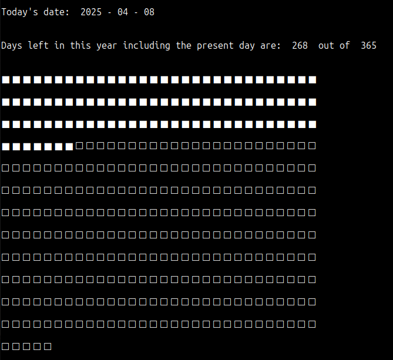

This program visualises the days spent and days left from a given date. By default, it uses the current date. One can make the program accept input by uncommenting today = input().split('-') line.

As 2024 was a leap year, the total days are 366. Calculating days left from the user input:

